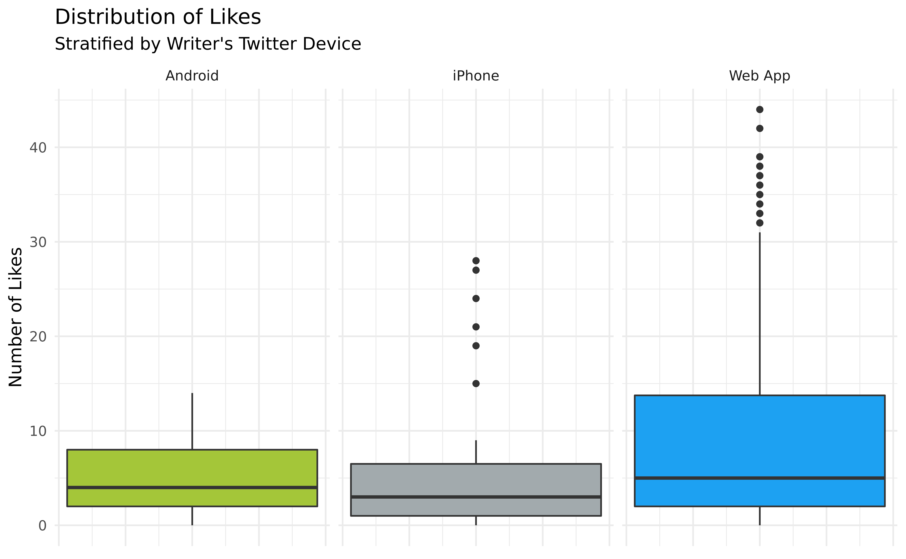

Project title
================
Ctrl Alt Elite

    ## ── Attaching packages ─────────────────────────────────────── tidyverse 1.3.1 ──

    ## ✓ ggplot2 3.3.5     ✓ purrr   0.3.4
    ## ✓ tibble  3.1.4     ✓ dplyr   1.0.7
    ## ✓ tidyr   1.1.3     ✓ stringr 1.4.0
    ## ✓ readr   2.0.1     ✓ forcats 0.5.1

    ## ── Conflicts ────────────────────────────────────────── tidyverse_conflicts() ──
    ## x dplyr::filter() masks stats::filter()
    ## x dplyr::lag()    masks stats::lag()

    ## 
    ## Attaching package: 'maps'

    ## The following object is masked from 'package:purrr':
    ## 
    ##     map

    ## Linking to GEOS 3.8.0, GDAL 3.0.4, PROJ 6.3.1

## Introduction

(1-2 paragraphs) Brief introduction to the dataset. You may repeat some
of the information about the dataset provided in the introduction to the
dataset on the TidyTuesday repository, paraphrasing on your own terms.
Imagine that your project is a standalone document and the grader has no
prior knowledge of the dataset.

## Question 1 \<- Update title to relate to the question you’re answering

### Introduction

(1-2 paragraphs) Introduction to the question and what parts of the
dataset are necessary to answer the question. Also discuss why you’re
interested in this question.

### Approach

(1-2 paragraphs) Describe what types of plots you are going to make to
address your question. For each plot, provide a clear explanation as to
why this plot (e.g. boxplot, barplot, histogram, etc.) is best for
providing the information you are asking about. The two plots should be
of different types, and at least one of the two plots needs to use
either color mapping or facets.

### Analysis

We will first create a bar plot that maps `location` on the y-axis and
the number of tweets from that location on the x-axis. This will require
creating a new variable `location_tweet_count`. As a user in one
location can tweet multiple times, we will consider all their tweets
cumulatively to look at total geographical engagement of users on this
plot. This is due to the fact that we consider multiple tweets by a user
to be a sign of engagement, and thus want to understand engagement on
the whole, versus on a per user basis. We will also need to mutate a new
variable `location_state`, based off of `location`, where location names
are modified to be a state in the United States, or categorized as an
international country. If there happen to be many international
locations in the data set from different counties, we will consider
having two bar plots - one for U.S. states, and one for other countries,
so that the visualization does not become too overcrowded. We could also
only display the top 10 or so locations on the bar plot, if need be for
simplification purposes (we do not want too much overwhelming info). We
will also need to look through the location data to remove any
observations which do not represent actual names of geographical
locations. By looking at this data and organizing it on a bar plot, we
will be able to compare engagement in the TidyTuesday challenge
geographically, to see which locations produced the most number of
tweets. The advantage of using a bar plot is that each location is very
distinguishable from the next, and the data can be ordered such that
it’s obvious visually which locations have many tweets, versus very
few tweets coming from them. This will also inform our next
visualization, as we will know which areas of the global map to
emphasize, if need be.

``` r
tweets %>%
  group_by(location) %>%
  summarize(location_tweet_count = n())
```

    ## # A tibble: 102 × 2
    ##    location                     location_tweet_count
    ##    <fct>                                       <int>
    ##  1 Albuquerque, NM                                 1
    ##  2 Amherst, MA                                     2
    ##  3 andrew.tran@washpost.com                        1
    ##  4 Arlington Heights, IL                           1
    ##  5 Arvada, CO                                      1
    ##  6 At the home office                              2
    ##  7 Baltimore, MD                                   2
    ##  8 Basingstoke, England                            2
    ##  9 Belgrade, Republic of Serbia                    1
    ## 10 Boston, MA                                      3
    ## # … with 92 more rows

``` r
# Data frame of cities of the world and corresponding countries
world_cities <- world.cities %>% 
  as_tibble() %>% 
  rename(c("city" = "name"))

# Data frame of cities in US and corresponding states
us_cities <- us_cities %>% 
  select(city, state_id, state_name)

# create new variable city that is the location pre ,
tweets_locations <- tweets %>% 
  filter(!str_detect(location, "@"), !str_detect(location, ":")) %>% 
  mutate(location_pre_comma = gsub(",.*","", location))
  

#Being funky, dont use this
#left_join(tweets_locations, us_cities, by = c("city"))
```

``` r
tweets %>%
  count(location) %>%
  arrange(desc(n)) %>% 
  head(15)
```

    ##                        location   n
    ## 1                      New York 125
    ## 2                          <NA>  59
    ## 3                 Nashville, TN  33
    ## 4               New Jersey, USA  30
    ## 5                    Merced, CA  15
    ## 6               Vienna, Austria  11
    ## 7  iPhone: 34.704040,-86.722909  10
    ## 8          Kevin.Elder@GCSU.edu  10
    ## 9                   Madison, WI  10
    ## 10              Minneapolis, MN  10
    ## 11                 New York, NY   9
    ## 12             Philadelphia, PA   5
    ## 13              California, USA   4
    ## 14                   Boston, MA   3
    ## 15                    Edinburgh   3

Idea for visualization 1 is to only do data analysis for international
places.

(2-3 code blocks, 2 figures, text/code comments as needed) In this
section, provide the code that generates your plots. Use scale functions
to provide nice axis labels and guides. You are welcome to use theme
functions to customize the appearance of your plot, but you are not
required to do so. All plots must be made with ggplot2. Do not use base
R or lattice plotting functions.

To next explore this inquiry, we will use the `lat`, `long`, and
`retweet_count` variables. To display the geographical distribution of
the data, we will use an external map of the world, on which we will
layer a scatter plot of the location of each tweet (where it was tweeted
from). We will use the latitude and longitude variables to accomplish
this, along with the world map coordinates that come from the
map\_data() function in tidyverse. Then, we will display the count of
retweets for each tweet by mapping the `retweet_count` variable to
color, size, or another scatterplot aesthetic, such that all of the
information is very clearly displayed on the world map. Since it will be
important to consider the population differences of the locations on the
map when analyzing the occurrence of tweets, we will create a separate
heatmap of the world (we will use external data of the 2021 population
of the world’s countries), to be displayed next to this map, to help
readers take population discrepancies into account. Thus, this
visualization will most likely employ color mapping.

``` r
# Loading posible map to use
worldmap <- ne_countries(scale = 'medium', type = 'map_units',
                         returnclass = 'sf')

world_map <- map_data("world")

us_map <- map_data("state")


# ggplot() +
#   geom_polygon(data = world_map, aes(x = long, y = lat, group = group), fill = "gray", color = "black") +
#   geom_point(data = tweets, aes(x = long, y = lat, size = retweet_count), color = "red") +
#   theme_minimal() +
#   coord_fixed(1.3)

  #coord_quickmap()


tweets <- tweets%>%
  mutate(continent=case_when(long < -46 & (lat>20 & lat < 46) ~ "North America", 
                             (long > -100  & long<50) &(lat>-100 & lat <20) ~ "South America", 
                             (long > -50  & long<60) &(lat>-50 & lat <50) ~ "Africa", 
                             
                            (long > 25) &(lat>-50 & lat <50) ~ "Europe", 
                            
                          (long > 50  & long<150) &(lat>-12.5) ~ "Asia", 
                          
                        (long > 100) &(lat<-12.5) ~ "Oceania"))
```

``` r
tweets_NA<-tweets%>%
  filter(continent=="North America")


# just mapping us data, need to get rid of canada
# ggplot() +
#   geom_polygon(data = us_map, aes(x = long, y = lat, group = group), fill = "white", color = "black") +
#   geom_point(data = tweets_NA, aes(x = long, y = lat, size = retweet_count), color = "red") +
#   theme_minimal() +
#   coord_quickmap()

north_am <- worldmap[worldmap$continent == 'North America',]
us <- worldmap[worldmap$name == 'United States',]

# New US map option
# ggplot() + 
#   geom_sf(data = us) + 
#   theme_bw() +
#   geom_point(data = tweets_NA, aes(x = long, y = lat, size = retweet_count), color = "red") 
```

Need to remove 3 canadian values from map.

### Discussion

(1-3 paragraphs) In the Discussion section, interpret the results of
your analysis. Identify any trends revealed (or not revealed) by the
plots. Speculate about why the data looks the way it does.

## Question 2 \<- Update title to relate to the question you’re answering

The second question we want to answer is:

*How does Twitter verification status affect user construction of
\#DuBois challenge tweets and how the audience reacts to those tweets?*

*How does the time of day affect user construction of \#DuBois challenge
tweets and how the audience reacts to those tweets?*

For the first visualization, we will use `verified` and `content` to
examine the length of tweets of verified and unverified users. First,
we’ll compute the length of each tweet’s content, operationalized by
the number of characters, including spaces and emojis, in the tweet, and
assign it to a numeric variable `tweet_length`. Then, we’ll create a
ridge plot to succinctly compare the densities of tweet lengths between
verified and unverified users. After seeing how verified users might
write their tweets differently, we would then like to look into how
users react to their tweets.

``` r
library(lubridate)
```

    ## 
    ## Attaching package: 'lubridate'

    ## The following objects are masked from 'package:base':
    ## 
    ##     date, intersect, setdiff, union

``` r
tweets <- tweets %>%
  filter(!is.na(datetime))%>%
  mutate(tweet_length = nchar(as.character(content)), 
                              time=(as.numeric(str_sub(datetime, start=12, end=13))))
        

ggplot(tweets, aes(x=time, y = tweet_length)) + 
  geom_col()
```

<!-- -->

``` r
tweets %>%
  filter(verified == TRUE) %>%
  nrow()
```

    ## [1] 4

Thus, for a second visualization, we will use the variables `followers`,
`verified` and `like_count`. We will map `followers` to the x axis, and
`like_count` to the y axis, and then display the data for each twitter
user using geom\_point. Since some users may have tweeted multiple
times, we will calculate `average_like_count` per tweet for each user,
and use that number in place of the actual `like_count` variable. This
means for users who only tweeted once, we will use the like count for
that tweet, while for users who tweeted multiple times, we will use the
average like count across all of their challenge tweets. We chose to
focus on individual users since in the previous visualization we were
looking into cumulative tweets, on a non per-user basis. This way, for
this question, we will be able to gauge Twitter engagement in the Dubois
challenge on a per user basis, marking a contrast between our questions.
Then, we will use color mapping to map the verification status of the
tweet author to the colors of the points, such that viewers can easily
distinguish between the two groups (if the groups are not
distinguishable, another option is to facet by verification status - we
will make a choice about this after seeing how the data looks). Further,
we’ll display a geom\_smooth regression line for verified and unverified
users (if these lines become visually distracting, we will reconsider
using them). With these lines, we’ll be able to examine the interaction
between verification and followers and its effect on the number of likes
a tweet can generate.

``` r
tweets <- tweets %>%
  group_by(username) %>%
  mutate(average_like_count = mean(like_count))


tweets_time<- tweets%>%
  mutate(time_range=case_when(time<=7~"Time 1", 
                              time>7 & time <=15~ "Time 2", 
                              time >15~"Time 3"))
ggplot(tweets_time, aes(followers, average_like_count))+
  geom_point()+
  facet_grid(~time_range)+
  scale_x_continuous(limits=c(0, 10000))+
  scale_y_continuous(limits=c(0, 200))
```

    ## Warning: Removed 10 rows containing missing values (geom_point).

<!-- -->

### Introduction

(1-2 paragraphs) Introduction to the question and what parts of the
dataset are necessary to answer the question. Also discuss why you’re
interested in this question.

### Approach

(1-2 paragraphs) Describe what types of plots you are going to make to
address your question. For each plot, provide a clear explanation as to
why this plot (e.g. boxplot, barplot, histogram, etc.) is best for
providing the information you are asking about. The two plots should be
of different types, and at least one of the two plots needs to use
either color mapping or facets.

### Analysis

(2-3 code blocks, 2 figures, text/code comments as needed) In this
section, provide the code that generates your plots. Use scale functions
to provide nice axis labels and guides. You are welcome to use theme
functions to customize the appearance of your plot, but you are not
required to do so. All plots must be made with ggplot2. Do not use base
R or lattice plotting functions.

### Discussion

(1-3 paragraphs) In the Discussion section, interpret the results of
your analysis. Identify any trends revealed (or not revealed) by the
plots. Speculate about why the data looks the way it does.

## Presentation

Our presentation can be found [here](presentation/presentation.html).

## Data

Include a citation for your data here. See
<http://libraryguides.vu.edu.au/c.php?g=386501&p=4347840> for guidance
on proper citation for datasets. If you got your data off the web, make
sure to note the retrieval date.

## References

List any references here. You should, at a minimum, list your data
source.
