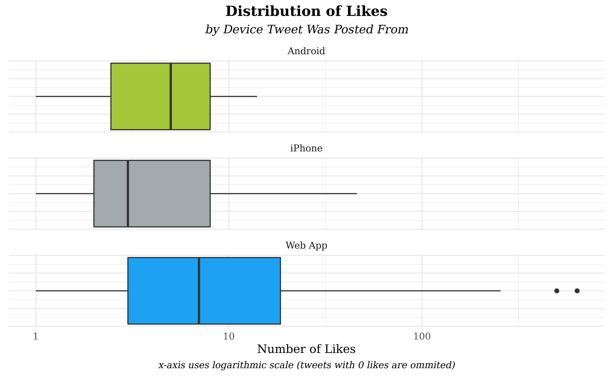
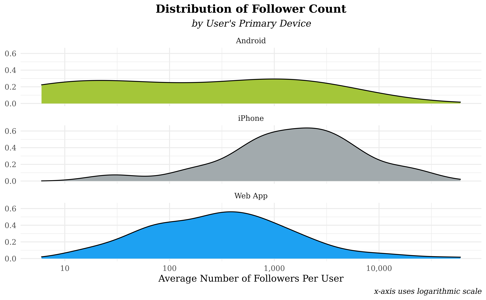

Twitter Trends from the \#DuBoisChallenge
================
by Ctrl+Alt+Elite

``` r
# Package messages suppressed
library(tidyverse)
library(maps)
library(sf)
library(rnaturalearth)
library(rvest)
library(ggthemes)
library(lubridate)
library(stringr)
library(colorspace)
library(scales)
library(ggrepel)
library(RColorBrewer)
```

``` r
knitr::opts_chunk$set(
  fig.width = 8,
  fig.asp = 0.618,
  fig.retina = 3,
  dpi = 300,
  out.width = "90%"
)
```

``` r
tweets <- read.csv("data/tweets.csv")
```

## Introduction

W.E.B Du Bois was one of the most multifaceted and persuasive civil
rights leaders in history; one of the channels he used to advance
equality was his profound work in data visualization. In order to
celebrate his legacy of using visualizations to do good in the world,
the \#DuBoisChallenge calls upon users to recreate a selection of Du
Bois’ visualizations from the 1900 Paris Exposition with the aid of
modern tools.

For our project, we’re choosing to focus on the 2021 WEB Du Bois &
Juneteenth Twitter challenge data - specifically, we’ll be looking at
the content and metadata of tweets that used the \#DuBoisChallenge
hashtag to engage with the challenge via a plot submission or with
commentary. There are a total of 13 different variables - such as
`like_count`, `lat`, `long`, and `content` - and 445 tweets to study.
From this data, we hope to learn how people engage with culturally
significant data visualizations in a social media setting.

## Location Analysis

*How does user participation and inter-user interaction in the
\#DuBoisChallenge vary with location?*

### Introduction to Q1

W.E.B. Du Bois is a national hero in American culture - one would expect
this hero status to result in overwhelming US participation, but the
\#DuBoisChallenge attracted interest from all over the world. The goal
of these sorts of competitions is twofold - to see what sorts of
innovative choices participants make as well as forming ties and
relationships between participants. By displaying where participants
come from and which regions tend to create inter-user relationships
(tags), we can advise future competitions on which target audiences are
most receptive - the end goal of such advice is to allow larger
competitions that attract a larger audience and form more relationships
among the participants.

Interestingly, Twitter metadata contains two different variables that
represent a user’s location. There is a `location` variable constructed
either from the user’s bio or their use of a geo-tag and there are `lat`
and `long`: the coordinates of the device at the time of tweet
publication. Per our question, we’d like to look at how the tweets are
spread around the world and differences in user behavior with other
users. Specifically, we’ll look at how users “tag” other users in their
challenge posts by counting the number of @user occurrences in each
tweet to create `tag_count`.

### Approach

In our first visualization, we will investigate the `location` character
variable. Due to the self-reported nature of `location`, many of the
entries are jokes, ambiguous, or in inconsistent formats. To address the
latter problem, we had to perform manual cleaning - US tweets tend to
record the state with some use of city names while international tweets
use a mixture of country and city labels. In order to standardize, we
converted US cities into their respective states and converted
significant foreign cities into country groups. While comparing states
and countries is atypical, the majority of the observed tweets are in
the US and the use of states allows tweets from other countries to be
studied. We proceed to count our cleaned `location` variable and narrow
the list to the top 10 entries. In order to display counts for discrete
location names, we chose to utilize a bar plot stratified into regions
(SE, SW, NE, NW, international) and sorted in descending order within
regions. Further, we’ve included a text layer with the percentage of
each bar out of the total tweets from the top 10 locations.

Our second visualization aims to display which areas of the world
published the most tweets during the challenge and how the number of
tags in a tweet might vary across the globe: the map format arose as a
natural candidate due to the need to plot coordinates and our goal of
comparing regions. Rather than create an overcrowded world map, we
instead chose to use the `long` and `lat` location variables to form two
maps - one of the Northeastern US and one of Europe - which each display
a layer of country border data, a layer of points, and a layer of
annotations. Each tweet point is colored, sized, and given transparency
values via mapping to `tag_count`, a variable formed by counting the
occurrence of @user strings within tweet `content`. Further, each point
is given random noise by geom\_jitter() in order to alleviate some of
the extreme clustering of points around NYC and the southern UK.

### Analysis

``` r
tweets <- tweets %>%
  mutate(tag_count = str_count(content, "@"))

tweets_locations <- tweets %>%
  filter(!str_detect(location, "@"), !str_detect(location, ":")) %>%
  mutate(
    location_pre_comma = gsub(",.*", "", location),
    location_pre_comma = case_when(
      location_pre_comma == "北京" ~ "Beijing",
      location_pre_comma == "God's earth" ~ "NA",
      location_pre_comma == "The City College of New York" ~ "New York",
      location_pre_comma == "World" ~ "NA",
      location_pre_comma == "he/they" ~ "NA",
      location_pre_comma == "At the home office" ~ "NA",
      location_pre_comma == "Deutschland" ~ "Germany",
      location_pre_comma == "Distrito Federal" ~ "Mexico City",
      location_pre_comma == "down in dey wid em" ~ "NA",
      location_pre_comma == "Forde-Obama Hall" ~ "NA",
      location_pre_comma == "France & UK" ~ "NA",
      location_pre_comma == "Lil’ Rudyshire" ~ "NA",
      location_pre_comma == "MIT" ~ "Boston",
      location_pre_comma == "New Yorker" ~ "New York",
      location_pre_comma == "OAK / NYC / ATL / The World" ~ "NA",
      location_pre_comma == "SP" ~ "NA",
      location_pre_comma == "Toronto || Ottawa" ~ "NA",
      location_pre_comma == "Tx" ~ "Texas",
      location_pre_comma == "UK" ~ "United Kingdom",
      location_pre_comma == "USA" ~ "United States",
      location_pre_comma == "Worldwide" ~ "NA",
      TRUE ~ location_pre_comma
    ),
    plot_state = case_when(
      location_pre_comma == "Nashville" ~ "Tennessee",
      location_pre_comma == "Merced" ~ "California",
      location_pre_comma == "Vienna" ~ "Austria",
      location_pre_comma == "Madison" ~ "Wisconsin",
      location_pre_comma == "Minneapolis" ~ "Minnesota",
      location_pre_comma == "Philadelphia" ~ "Pennsylvania",
      location_pre_comma == "Boston" ~ "Massachusetts",
      location_pre_comma == "London" ~ "United Kingdom",
      location_pre_comma == "Edinburgh" ~ "United Kingdom",
      location_pre_comma == "Amherst" ~ "Massachusetts",
      location_pre_comma == "Buffalo" ~ "New York",
      location_pre_comma == "Cambridge" ~ "Massachusetts",
      location_pre_comma == "San Diego" ~ "California",
      TRUE ~ as.character(location_pre_comma)
    )
  )

top_10_locations <- tweets_locations %>%
  count(plot_state) %>%
  arrange(desc(n)) %>%
  filter(plot_state != "NA") %>%
  head(10) %>%
  mutate(
    region = case_when(
      plot_state == "New York" ~ "US: Northeast",
      plot_state == "New Jersey" ~ "US: Northeast",
      plot_state == "Pennsylvania" ~ "US: Northeast",
      plot_state == "Massachusetts" ~ "US: Northeast",
      plot_state == "Tennessee" ~ "US: South",
      plot_state == "California" ~ "US: West",
      plot_state == "Austria" ~ "Europe",
      plot_state == "United Kingdom" ~ "Europe",
      plot_state == "Wisconsin" ~ "US: Midwest",
      plot_state == "Minnesota" ~ "US: Midwest"
    ),
    region = fct_relevel(region, c(
      "US: Northeast", "Europe", "US: Midwest", "US: South",
      "US: West"
    )),
    plot_state = fct_relevel(plot_state, c(
      "New York", "New Jersey", "Massachusetts",
      "Pennsylvania", "Austria", "United Kingdom",
      "Minnesota",
      "Wisconsin", "Tennessee", "California"
    )),
    plot_state = fct_rev(plot_state),
    percent_tweets = paste(round(n / sum(n), 4) * 100, "%")
  )

northeast_tweets <- tweets %>%
  filter(
    long <= -70,
    long >= -90,
    lat <= 46,
    lat >= 20
  )
europe_tweets <- tweets %>%
  filter(
    long >= -20 & long <= 45,
    lat >= 30 & lat <= 73
  )

world_map <- ne_countries(
  scale = "medium", type = "map_units",
  returnclass = "sf"
)
us_map <- map_data("state")
canada_map <- map_data("world", "canada")

US_locations <- tribble(
  ~city, ~lat, ~long,
  "NYC", 40.7128, -74.0060,
  "Baltimore", 39.2904, -76.6122
)

EU_locations <- tribble(
  ~city, ~lat, ~long,
  "London", 51.5074, -0.1278,
  "Vienna", 48.2082, 16.3738,
  "Rome", 41.9028, 12.4964
)
```

``` r
ggplot(data = top_10_locations, aes(y = plot_state, x = n, fill = region)) +
  geom_col() +
  geom_text(aes(label = percent_tweets, color = region),
    size = 2.5,
    nudge_x = 8,
    show.legend = FALSE
  ) +
  scale_fill_brewer(palette = "Set1") +
  scale_color_brewer(palette = "Set1") +
  scale_x_continuous(
    breaks = c(0, 20, 40, 60, 80, 100, 120, 140, 160, 180, 200)
  ) +
  labs(
    title = "Top 10 #DuBoisChallenge Tweet Locations",
    caption = "% calculated out of top 10",
    x = "Number of Tweets",
    y = "User Location in Twitter Bio",
    fill = "Location"
  ) +
  theme_minimal() +
  theme(
    plot.title = element_text(hjust = 0.5, face = "bold"),
    plot.caption = element_text(face = "italic"),
    legend.title = element_blank(),
    legend.position = c(.848, .25),
    text = element_text(family = "Times New Roman")
  )
```


``` r
set.seed(1234)

ggplot() +
  geom_polygon(
    data = canada_map,
    aes(x = long, y = lat, group = group),
    fill = "#F0F0F0",
    color = "black"
  ) +
  geom_polygon(
    data = us_map,
    aes(x = long, y = lat, group = group),
    fill = "#F0F0F0", color = "black"
  ) +
  geom_jitter(
    data = northeast_tweets,
    width = 0.5, height = .5,
    aes(
      x = long, y = lat, size = tag_count, color = tag_count,
      alpha = tag_count
    )
  ) +
  labs(
    title = "#DuBoisChallenge Tweets",
    subtitle = "in Northeastern U.S. & Canada\n",
    caption = "Based on Location Where Tweet Was Published",
    size = "# of Users Tagged",
    color = "# of Users Tagged",
    alpha = "# of Users Tagged"
  ) +
  theme_void() +
  scale_color_continuous_sequential(
    palette = "OrYel", rev = FALSE,
    breaks = c(0, 2, 4, 6, 8, 10)
  ) +
  scale_size_continuous(range = c(2, 5), breaks = c(0, 2, 4, 6, 8, 10)) +
  scale_alpha_continuous(range = c(.27, 1), breaks = c(0, 2, 4, 6, 8, 10)) +
  guides(
    color = guide_legend(),
    size = guide_legend(),
    alpha = guide_legend()
  ) +
  theme(
    plot.title = element_text(hjust = 0.5, face = "bold"),
    plot.subtitle = element_text(hjust = 0.5, face = "italic"),
    plot.caption = element_text(hjust = 0.5),
    legend.position = "bottom",
    panel.border = element_rect(color = "black", fill = NA, size = .75),
    panel.background = element_rect(color = "black", fill = "lightblue"),
    text = element_text(family = "Times New Roman")
  ) +
  geom_text_repel(
    data = US_locations,
    aes(x = long, y = lat, label = city),
    size = 3, nudge_x = -0.15,
    nudge_y = 0.95,
    segment.linetype = "dotted"
  ) +
  coord_map(
    xlim = c(-80, -65),
    ylim = c(36, 46)
  )
```


``` r
ggplot() +
  geom_sf(data = world_map, fill = "#F0F0F0", color = "black") +
  geom_jitter(
    data = europe_tweets,
    aes(
      x = long, y = lat, size = tag_count, color = tag_count,
      alpha = tag_count
    )
  ) +
  coord_sf(xlim = c(-20, 45), ylim = c(30, 73), expand = FALSE) +
  labs(
    title = "#DuBoisChallenge Tweets",
    subtitle = "in Europe\n",
    caption = "Based on Location Where Tweet Was Published",
    size = "# of Users Tagged",
    alpha = "# of Users Tagged",
    color = "# of Users Tagged"
  ) +
  theme_void() +
  scale_color_continuous_sequential(
    palette = "OrYel", rev = FALSE,
    breaks = c(0, 2, 4, 6, 8, 10)
  ) +
  scale_size_continuous(range = c(2, 5), breaks = c(0, 2, 4, 6, 8, 10)) +
  scale_alpha_continuous(range = c(.27, 1), breaks = c(0, 2, 4, 6, 8, 10)) +
  guides(
    color = guide_legend(),
    size = guide_legend(),
    alpha = guide_legend()
  ) +
  theme(
    plot.title = element_text(hjust = 0.5, face = "bold"),
    plot.subtitle = element_text(hjust = 0.5, face = "italic"),
    plot.caption = element_text(hjust = 0.5),
    legend.position = "bottom",
    panel.border = element_rect(color = "black", fill = NA, size = .75),
    panel.background = element_rect(color = "black", fill = "lightblue"),
    text = element_text(family = "Times New Roman")
  ) +
  geom_text_repel(
    data = EU_locations,
    aes(x = long, y = lat, label = city),
    size = 3,
    nudge_x = -14, nudge_y = -0.3,
    segment.linetype = "dotted"
  )
```


### Discussion

Our first plot clearly shows that most of the Twitter challenge activity
is occurring in the US; eight of the ten locations were US states even
though these states were being directly compared to entire foreign
countries. The only international locations in the plot - the UK and
Austria - account for merely 7.88% out of the top 10 locations. This
confirms our initial assumption that most people interested in and
interacting with this challenge are in the US. Domestically, four of the
top ten locations are northeastern states: an unsurprising find when
considering population figures and Du Bois’s legacy in NYC. Moving
forward in our analysis, we chose to focus on the Northeast and Europe
to study their users and how they may engage each other differently in
the two regions.

Our second visualization is a set of two maps of the Northeastern United
States and Europe with point coloring/sizing by the number of @tags. One
advantage of the `long` and `lat` variable over the previous plot’s
`location` is that we can more precisely display areas where tweet
clustering occurs rather than user home locations. For example, the
Northeast map shows the dominant NYC cluster extending outwards towards
Newark, NJ while another small cluster exists around Baltimore. In
Europe, there is a low-density cluster centered in London and small
clusters in major cultural cities such as Rome and Vienna, but the
overall number of tweets is far lower than in the US. A glance at the
`tag_count` mappings proves more fruitful - in both maps, the low tag
counts are most frequent in all regions, but high tag counts appear
exclusively in cluster centers. Since these clusters are all
cosmopolitan cities, it’s reasonable to speculate that their users would
have the most ties to other participants and thus the ability to tag
more people per tweet. However, due to the low number of observations
and the correlational nature of the data, we lack the evidence to make a
causal claim that cosmopolitan cities generate more tags (and thus more
user interactions). Further, our metric to study inter-user
interactions, `tag_count`, is an imperfect proxy for how users speak.
Not every tag is a meaningful connection between users and the
relationship between tagging and user interaction is confounded by this
ambiguity.

## Twitter Posting Mediums and Audience Engagement

*What is the relationship between the device that publishes a tweet and
how the audience engages with the author?*

### Introduction

We’re interested in how the different “mediums” of publishing to Twitter
are related to the success of the tweet. Based on our own anecdotal
experiences, we believe that tweets from traditional computers may be
constructed less impulsively than mobile tweets . Further, there are
socioeconomic factors tied to which device one picks as well as content
considerations; one can easily publish \#DuBoisChallenge commentary from
an iPhone, but a full plot submission would be exceedingly difficult. By
mapping out how such limitations influence audience response, we hope to
discover which devices are best-suited for both low-visibility
commentary and high-visibility challenge submissions.

For this question, we intend to explore how various audience approval
metrics vary with the type of device used by the tweet author. To do
this, we’ll be manipulating the `text` variable - a character of the
platform/access point that the device used to access Twitter - by
parsing it through case\_when with specific string detections. Then, we
will examine `followers` and `like_count` and their relationship with
`devicetype`. Unlike the other two variables, the number of followers is
not exclusively set by one tweet, but by the user’s long-term success.
In recognition of this disparity, we intend to display the relationship
between `followers` and `devicetype` with groupings by username and
`avg_followers`

### Approach

Our first plot dives into the relationship between `like_count` and
`devicetype` by showing side-by-side boxplots stratified by
`devicetype`; our goal is to directly compare how different platforms
generate likes and boxplots are especially well-suited to comparing
similar distributions. Further, the measures of central tendency -
medians and quartiles - are easier to view in boxplot form and better
communicate the audience’s reaction to a tweet. Boxplots cannot
accommodate large numbers of groups easily, however, so we chose to
narrow our analysis to the three device types that form the overwhelming
majority of the data (iPhone, Android, and Web App). There is an
incredibly strong right skew in the like counts, but applying a
log-transform on the x-axis allows all the data to be visible.

Our second plot shows the distribution of follower count per user
stratified across the three most popular device types. In order to
assign each user a single follower count and device type, we use the
average number of followers across all their tweets and assign a device
type based on the user’s most common way to access twitter. Thus, the
plot examines the relationship between the primary device that a user
owns and their average number of followers during the competition. We
chose to show the distributions of follower count as density plots in
order to better examine the shapes of the distributions; we’re
interested in not only typical users, but also “extreme” users from the
right tail of the distribution. In order to make these extreme values
more visible, a log scale is applied to average follower counts.

### Analysis

``` r
tweets <- tweets %>%
  mutate(devicetype = case_when(
    str_detect(text, "Twitter Web App") ~ "Web App",
    str_detect(text, "Twitter for iPhone") ~ "iPhone",
    str_detect(text, "Twitter for Android") ~ "Android",
    str_detect(text, "Buffer") ~ "Buffer",
    str_detect(text, "Twitter for iPad") ~ "iPad",
    str_detect(text, "TweetDeck") ~ "TweetDeck",
    str_detect(text, "Crowdfire App") ~ "Crowdfire App",
    str_detect(text, "Twitter for Mac") ~ "Mac"
  ))

tweets_device <- tweets %>%
  filter(devicetype == "iPhone" |
    devicetype == "Web App" |
    devicetype == "Android")

users_and_devicetype <- tweets %>%
  group_by(username) %>%
  select(username, devicetype) %>%
  count(devicetype) %>%
  arrange(desc(n)) %>%
  slice(1) %>%
  select(-n)

users_and_avg_follower <- tweets %>%
  group_by(username) %>%
  summarise(avg_followers = mean(followers))

joined_devices_follower <- inner_join(users_and_devicetype,
  users_and_avg_follower,
  by = "username"
) %>%
  filter(devicetype == "iPhone" |
    devicetype == "Web App" |
    devicetype == "Android")
```

``` r
# Plot drops NAs and tweets with 0 likes since log(0) is undefined
ggplot(data = tweets_device, aes(x = like_count, fill = devicetype)) +
  facet_wrap(~devicetype, ncol = 1) +
  geom_boxplot(show.legend = FALSE) +
  scale_fill_manual(values = c("#a4c639", "#A2AAAD", "#1DA1F2")) +
  scale_x_log10() +
  labs(
    title = "Distribution of Likes",
    subtitle = "by Device Tweet Was Posted From",
    caption = "x-axis uses logarithmic scale (tweets with 0 likes are ommited)",
    x = "Number of Likes",
    y = NULL 
  ) +
  theme_minimal() +
  theme(
    plot.title = element_text(hjust = 0.5, face = "bold"),
    plot.subtitle = element_text(hjust = 0.5, face = "italic"),
    plot.caption = element_text(face = "italic", hjust = 0.5),
    axis.ticks = element_blank(),
    axis.text.y = element_blank(),
    text = element_text(family = "Times New Roman")
  )
```



``` r
# Plot drops NAs and tweets with 0 likes since log(0) is undefined
ggplot(
  data = joined_devices_follower,
  aes(x = avg_followers, fill = devicetype)
) +
  geom_density(show.legend = FALSE) +
  facet_wrap(. ~ devicetype, nrow = 3) +
  theme_minimal() +
  scale_x_log10(labels = label_number(big.mark = ",")) +
  scale_fill_manual(values = c("#a4c639", "#A2AAAD", "#1DA1F2")) +
  scale_y_continuous(labels = label_number(accuracy = .1)) +
  labs(
    title = "Distribution of Follower Count",
    subtitle = "by User's Primary Device",
    caption = "x-axis uses logarithmic scale", 
    x = "Average Number of Followers Per User",
    y = NULL
  ) +
  theme(
    plot.title = element_text(hjust = 0.5, face = "bold"),
    plot.subtitle = element_text(hjust = 0.5, face = "italic"),
    plot.caption = element_text(face = "italic"),
    text = element_text(family = "Times New Roman")
  )
```



### Discussion

In our first visualization, we immediately see strong skew in all three
device types and their number of likes - the presence of the logarithmic
scale implies that a “symmetric” box is actually strongly right-skewed.
The strongest right skew and highest median number of likes belongs to
Web App tweets. One possible explanation is the challenge’s format -
most tweets are either going to be a plot recreation or commentary on
another plot. We suspect that plots are disproportionately published by
web apps due to screen size required to work with data visualization -
since plots will generally earn more viewership than commentary, web app
posts are more likely to attain superstar status.

Our second distribution examines average followers rather than likes in
order to assess long-term success rather than individual post success.
Overall, Android tweets have a flat distribution while iPhones and Web
Apps have left and right skew in the plot, respectively. However, the
use of a logarithmic scale means that these shapes correspond to
strongly right-skewed data. Of these distributions, web app tweets are
skewed the furthest to the right followed by Androids and iPhones. In
terms of modal values in the distributions, iPhones have the sharpest
and largest peak followed by a slightly lower mode for web apps and no
clear peak for Android tweets.

The finding from both visualizations that web app users are strongly
skewed towards positive audience reception may be indicative of the fact
that it is much easier to type out and structure tweets on a computer
than it is on a phone. In fact, one study from Grammarly showed that
people make five times as many writing errors on their phone than on a
PC. This may be one potential reason why tweets authored on a Web App
device seem to attract more likes than those authored on a mobile device
like an Android or iPhone – they could be written more methodically and
profoundly. Importantly, the author may have wanted to craft the tweet
more carefully because they had more substantive information to share,
such as a plot made for the TidyTuesday challenge versus a reaction to a
plot someone else shared. It thus follows that tweets crafted using the
Web App would result in more likes, since we would expect users to be
more engaged in a visualization than simply reaction to a visualization.
We are unfortunately limited by the lack of a variable to distinguish
challenge submissions and commentary as well as the correlational nature
of our Twitter data.

## Presentation

Our presentation can be found [here](presentation/presentation.html).

## Data

Starks, A, Hillery, A, Tyler, S 2021, *Du Bois and Juneteenth revisited:
TidyTuesday week 8 of 2021*, electronic dataset, tidytuesday, retrieved
13 September 2021,
<https://github.com/rfordatascience/tidytuesday/blob/master/data/2021/2021-06-15/readme.md>.

## References

[Data
Source](https://github.com/rfordatascience/tidytuesday/blob/master/data/2021/2021-06-15/readme.md)

[Grammarly
Article](https://www.theladders.com/career-advice/study-you-make-5-times-as-many-errors-writing-on-your-phone-than-on-your-computer)

[Android Logo
Color](https://encycolorpedia.com/a4c639#:~:text=The%20hexadecimal%20color%20code%20%23a4c639,%25%20green%20and%2022.35%25%20blue.)

[Apple Logo Color](https://www.brandcolorcode.com/apple)

[Twitter Logo
Color](https://www.onlinepalette.com/twitter/#:~:text=Twitter%20uses%20the%20colors%20blue,29%2C%20161%2C%20242)

[Europe
Map](https://www.r-bloggers.com/2019/04/zooming-in-on-maps-with-sf-and-ggplot2/)

[Latitude and Longitude of Cities](https://www.google.com/maps)
